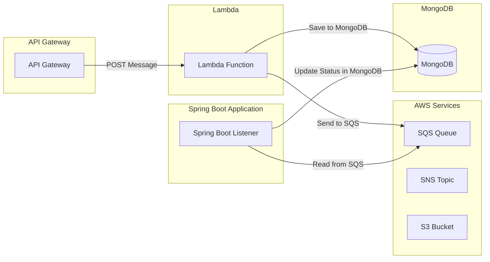

# Event-Driven Application

Este proyecto es un ejemplo de una aplicación orientada a eventos que utiliza AWS LocalStack para emular servicios de AWS como SQS, Lambda, API Gateway y MongoDB para almacenamiento de datos. La aplicación permite enviar mensajes a través de una API Gateway, que luego son procesados por una función Lambda y almacenados en una cola SQS y en MongoDB. Una aplicación Spring Boot actúa como listener para los mensajes en la cola SQS y actualiza el estado en MongoDB.

## Tecnologías Utilizadas

- **AWS LocalStack**: Emulación de servicios AWS.
- **API Gateway**: Punto de entrada para las solicitudes HTTP.
- **AWS Lambda**: Función que procesa las solicitudes y envía mensajes a SQS.
- **SQS (Simple Queue Service)**: Servicio de cola para mensajes.
- **MongoDB**: Base de datos NoSQL para almacenar el estado de los mensajes.
- **Spring Boot**: Aplicación que actúa como listener para la cola SQS.

## Diagrama de Arquitectura



# Configuración del Proyecto

## Requisitos
- **Docker y Docker Compose instalados.**
- **Java 21.**
- **Maven instalado para compilar la aplicación Spring Boot.**
- **Python y pip para gestionar dependencias de Lambda.**

## Configuración Inicial
1. Crear un entorno virtual para Python e instalar las dependencias necesarias como boto3 y pymongo.
    - ``` python -m venv venv ```
2. Activa el entorno virtual.
    - ``` source venv/Scripts/activate ```    
3. Instalar las dependencias de la función Lambda.
    - ``` source venv/Scripts/activate ```    

## Configuración del Proyecto
   1. El archivo docker-compose.yml incluye todos los servicios necesarios: MongoDB, LocalStack, y Swagger UI.
   2. Servicios principales:
       - **MongoDB**: Base de datos utilizada para almacenar los registros de los mensajes.
       - **LocalStack**: Emula servicios de AWS como SQS, Lambda y API Gateway.
       - **Swagger UI**: Permite la visualización de la documentación del API Gateway.

## Configuración de Variables de Entorno   
   1. Archivo .env para definir variables como:
            
            COMPOSE_PROJECT_NAME=localstack-sqs-docker

            #Mongo Config#
            DATA_BASE_USER_NAME=root
            DATA_BASE_USER_PASSWORD=root
            DATA_BASE_HOST=mongo-dev:27017
            DATA_BASE_NAME=sqs_status
            COLLECTION_NAME=messages

            #Credentials AWS#
            DEFAULT_REGION=us-east-1
            AWS_ACCESS_KEY_ID=test
            AWS_SECRET_ACCESS_KEY=test

## Estructura del Proyecto
- **src/**: Código fuente de la aplicación Java con Spring Boot para escuchar mensajes de SQS. 
- **lambda/**: Código Python de la función Lambda.
- **docker-compose.yml**: Configuración de Docker Compose para levantar todos los servicios.
- **scripts/setup.sh**: Script para configurar y crear los recursos en LocalStack (colas SQS, API Gateway, etc.).
- **openapi/openapi.yaml**: Especificación de la API Gateway en formato OpenAPI 3.0.
- **build.sh**: Este script está diseñado para construir y empaquetar una función Lambda con sus dependencias listas para ser desplegadas en AWS.      

## Despliegue Local
   1. Ejecuta ``` sh ./build.sh ``` para construir y empaquetar una función Lambda con sus dependencias listas para ser desplegadas en AWS
   2. Ejecuta ``` docker-compose up ``` para iniciar todos los servicios.
   3. **Configurar AWS LocalStack**
      - Con el contenedor en ejecución, ejecuta:
        - ``` docker-compose exec aws-cli bash ```
        - ``` export AWS_PAGER="" ```
        - ``` sh /scripts/setup.sh ```
      > [!NOTE]
      > Al finalizar la ejecucion de setup.sh vamos a obtener el API_ID
## Pruebas   
   **Enviar un Mensaje a la Cola SQS**  
   1.      
    curl --location 'http://localhost:4566/restapis/u9r8xzhclw/test/_user_request_/send-message' \
    --header 'Content-Type: application/json' \
    --data '{
    "message": "Este es un mensaje de pruebaq",
    "id": 1
    }'